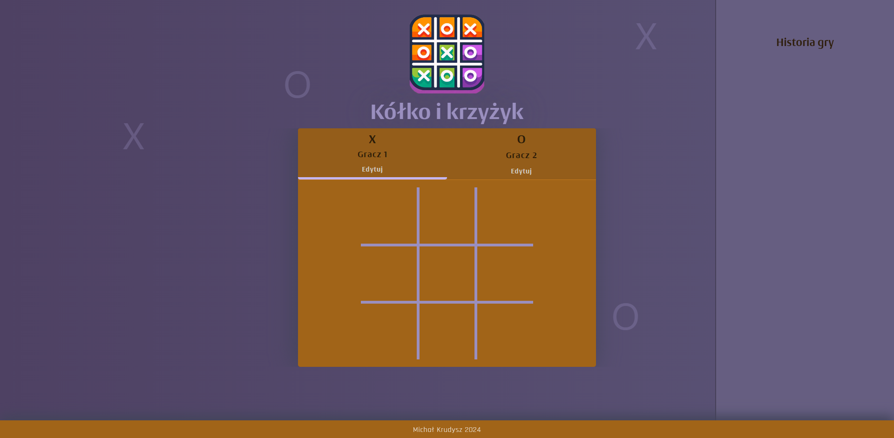
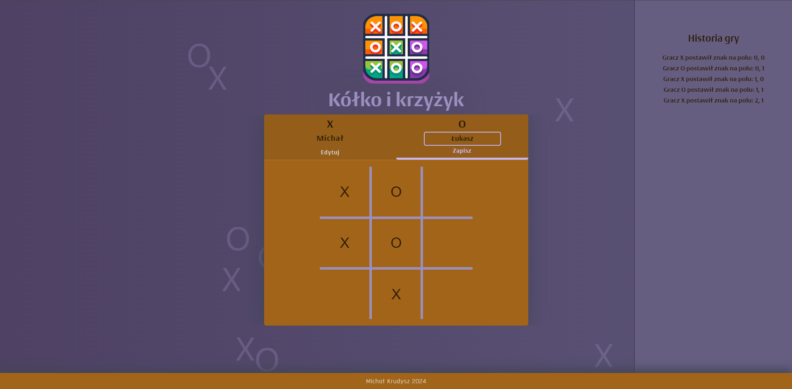
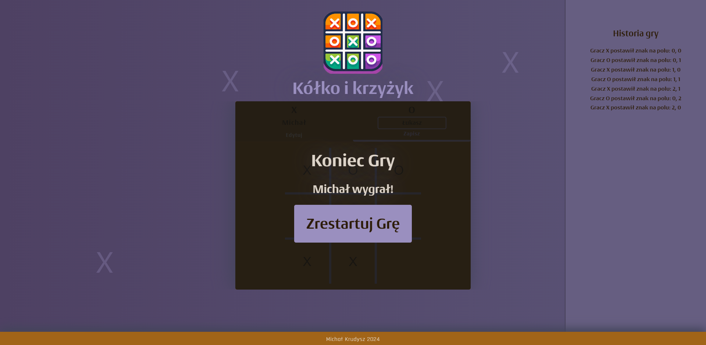

# Tic-Tac-Toe Game with Animated Background

## Brief Description

This Tic-Tac-Toe game is crafted using React and features a dynamic background with "floating" X and O symbols that react to the user's mouse movements. Players have the ability to personalize their names, which are showcased throughout the game. The application boasts a game board for players to alternately place their marks in an attempt to secure a win by aligning symbols correctly. The game monitors moves and exhibits a log of actions. Upon the conclusion of a game, it proclaims the winner or a draw and offers an option to restart the game. This project was undertaken as a learning initiative and does not conform to responsive design standards for various displays.

## Technologies

- React
- SCSS
- React hooks (useState, useEffect)

## Features

- **Animated Background**: A lively backdrop for the game board, adorned with the game's symbols (X and O) "floating" in space. These symbols drift randomly and respond to mouse hovering by altering their trajectory.
- **Player Name Change**: Offers the functionality for players to edit their names both prior to and during the game.
- **Game Board**: A platform where players take turns placing their symbols.
- **Game Turn Log**: A record that logs and displays each move during the game, indicating which player marked which field.
- **Game Over Screen**: Upon the game's conclusion, a screen is displayed announcing the winner or declaring a draw. This screen also features a button to reset the game.
- **Game Logic**: The game logic dynamically adapts to the players' interactions, blocking moves on already occupied fields and determining the outcome of the game based on the board's state.

## App Screenshots

### Home Page

### Custom Player Names and Board

### Finished Game

## Pre-installation Requirements

A Node.js environment is necessary to run the application locally. To get started:

1. Clone the project repository.
2. Navigate to the project directory and execute `npm install` to install dependencies.
3. Run `npm start` to initiate the application in development mode.
